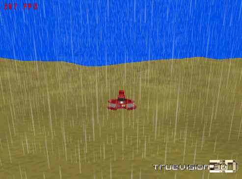

## Rain for 3rd Person View

### Description

This sample shows creating a neat and FPS friendly 3rd Person View Rain effect using a 3ds cylinder and and TexMod to scroll the texture.
 
### More Info
 
NOTE!!!!

You are required to have TV 6 Final. Download from http://www.truevision3d.com

Either the Lite version or full version will do.

Download Full version if you want to learn TV3D since it contains a lot of samples and tutorials.

             |
---                |---
**Submitted On**   |2003-08-14 11:16:08
**By**             |[errrRus](https://github.com/Planet-Source-Code/PSCIndex/blob/master/ByAuthor/errrrus.md)
**Level**          |Beginner
**User Rating**    |5.0 (10 globes from 2 users)
**Compatibility**  |VB 5\.0, VB 6\.0
**Category**       |[Games](https://github.com/Planet-Source-Code/PSCIndex/blob/master/ByCategory/games__1-38.md)
**World**          |[Visual Basic](https://github.com/Planet-Source-Code/PSCIndex/blob/master/ByWorld/visual-basic.md)
**Archive File**   |[Rain\_for\_31629688142003\.zip](https://github.com/Planet-Source-Code/errrrus-rain-for-3rd-person-view__1-47707/archive/master.zip)

